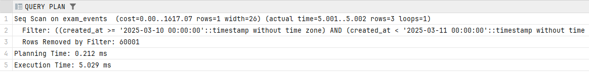
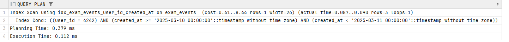
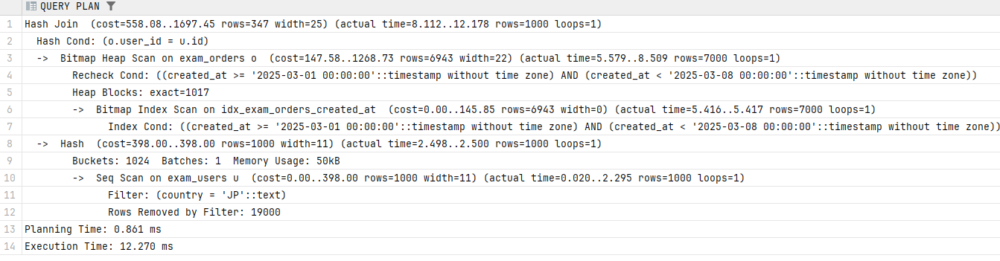
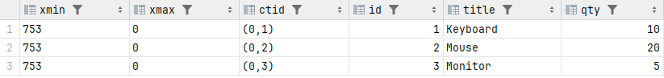
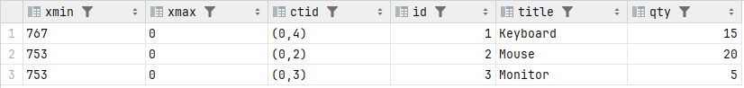
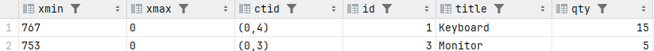
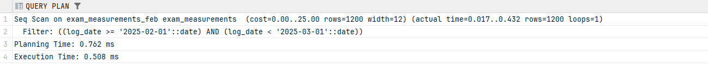
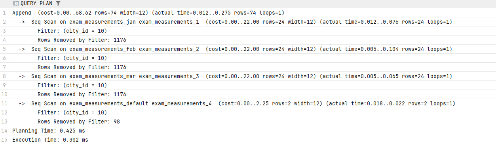

ЗАДАНИЕ 1

```sql

EXPLAIN ANALYSE SELECT id, user_id, amount, created_at
FROM exam_events
WHERE user_id = 4242
  AND created_at >= TIMESTAMP '2025-03-10 00:00:00'
  AND created_at < TIMESTAMP '2025-03-11 00:00:00';
```


Эти индексы не помогают
```sql
CREATE INDEX idx_exam_events_status ON exam_events (status);
CREATE INDEX idx_exam_events_amount_hash ON exam_events USING hash (amount);
```

```sql
CREATE INDEX idx_exam_events_user_id_created_at ON exam_events (user_id, created_at);
```

```sql
EXPLAIN ANALYSE SELECT id, user_id, amount, created_at
FROM exam_events
WHERE user_id = 4242
  AND created_at >= TIMESTAMP '2025-03-10 00:00:00'
  AND created_at < TIMESTAMP '2025-03-11 00:00:00';
```



seq scan заменился на index scan

Нужно использовать ANALYZE, чтобы узнать используется ли индекс в реальности

Задание 2

```sql
EXPLAIN ANALYSE SELECT u.id, u.country, o.amount, o.created_at
FROM exam_users u
JOIN exam_orders o ON o.user_id = u.id
WHERE u.country = 'JP'
  AND o.created_at >= TIMESTAMP '2025-03-01 00:00:00'
  AND o.created_at < TIMESTAMP '2025-03-08 00:00:00';
```


HASH JOIN

Планировщик выбирает этот тип join, когда нет подходящих индексов по обеим таблицам и таблицы достаточно большие

CREATE INDEX idx_exam_orders_created_at ON exam_orders (created_at); - немного полезен
CREATE INDEX idx_exam_users_name ON exam_users (name); - бесполезен

```sql
CREATE INDEX idx_exam_users_id_country ON exam_users USING hash(country);
```
Этот индекс немного ускорит фильтрацию.

Тип join все равно не меняется, не смотря на индексы, потому что мало данных

shared hit показывает количество страниц прочитанных из кэша

ЗАДАНИЕ 3

```sql
SELECT xmin, xmax, ctid, id, title, qty
FROM exam_mvcc_items
ORDER BY id;
```



```sql
UPDATE exam_mvcc_items
SET qty = qty + 5
WHERE id = 1;

SELECT xmin, xmax, ctid, id, title, qty
FROM exam_mvcc_items
ORDER BY id;
```



xmin изменился

Update происходит как удаление и запись. В бд все еще есть строчка с xmin=753, но у неё xmax=767

```sql

DELETE FROM exam_mvcc_items
WHERE id = 2;

SELECT xmin, xmax, ctid, id, title, qty
FROM exam_mvcc_items
ORDER BY id;
```

Delete ставит xmax = номер транзакции удалившей строчку и она не показывается в обычном select



VACUUM - удаление строчек, на которые никто не ссылается и они помечены на удаление
autovacuum - автоматически производится VACUUM через определенные промежутки времени
VACUUM FULL - полное перестраивание структуры бд, ужимание данных

VACUUM FULL полностью блокирует доступ к бд

Задание 4
В обоих случаях вторая транзакцию ждала окончания первой, результат увеличивался на 1


ЗАДАНИЕ 5

```sql
CREATE TABLE exam_measurements (
    city_id INTEGER NOT NULL,
    log_date DATE NOT NULL,
    peaktemp INTEGER,
    unitsales INTEGER
) PARTITION BY RANGE (log_date);

CREATE TABLE exam_measurements_jan PARTITION OF exam_measurements
    FOR VALUES FROM ('2025-01-01') TO ('2025-02-01');

CREATE TABLE exam_measurements_feb PARTITION OF exam_measurements
    FOR VALUES FROM ('2025-02-01') TO ('2025-03-01');

CREATE TABLE exam_measurements_mar PARTITION OF exam_measurements
    FOR VALUES FROM ('2025-03-01') TO ('2025-04-01');

CREATE TABLE exam_measurements_default PARTITION OF exam_measurements DEFAULT;

INSERT INTO exam_measurements SELECT * FROM exam_measurements_src;
```

```sql
SELECT city_id, log_date, unitsales
FROM exam_measurements
WHERE log_date >= DATE '2025-02-01'
  AND log_date < DATE '2025-03-01';
```



Partition pruning есть так как используется одна секция

```sql
EXPLAIN ANALYSE SELECT city_id, log_date, unitsales
FROM exam_measurements
WHERE city_id = 10;
```



Partition pruning нет, так как используются все секции

Потому что в первом запрос поиск с where по полю секционирования, поэтому есть partition pruning

default нужна, потому что 3 месяца не охватывают весь промежуток, и будут даные без секции, что приведет к ошибке.