```sql
INSERT INTO steam.genres(name) VALUES ('test1');

SELECT ctid, xmin, xmax, * from steam.genres;
```

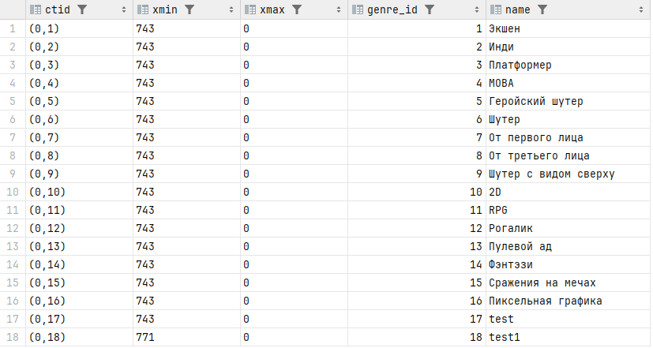

```sql
UPDATE steam.genres SET name = 'new_test1' WHERE genre_id = 18;

SELECT ctid, xmin, xmax, * from steam.genres;
```

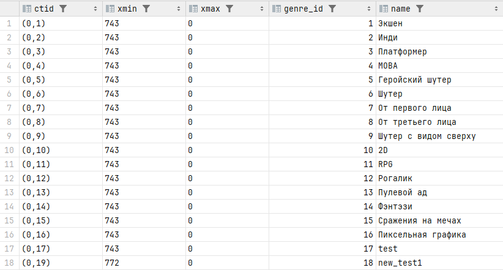


```sql
SELECT
t_ctid,        -- Физический адрес версии
t_xmin,        -- Кто вставил эту версию
t_xmax,        -- Кто удалил эту версию
t_infomask     -- Флаги (удаление, блокировка и т.д.)
FROM heap_page_items(get_raw_page('steam.genres', 0));
```
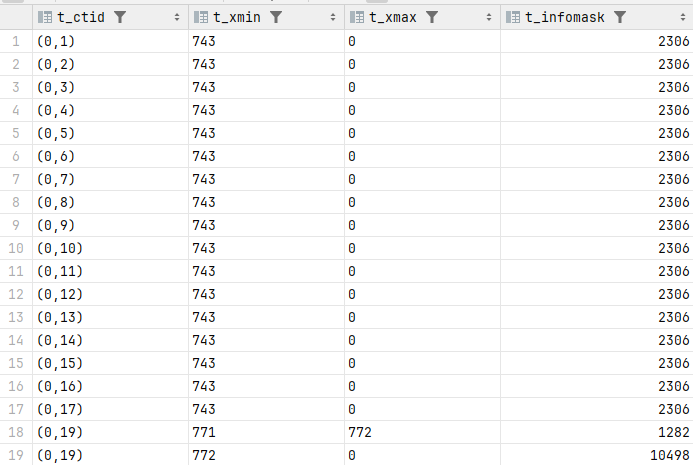

```sql
INSERT INTO steam.genres(name) VALUES ('deadlock_1'),('deadlock_2');

SELECT * from steam.genres;
```
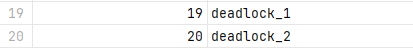

READ COMMITED
```sql
BEGIN TRANSACTION ISOLATION LEVEL READ COMMITTED ;
SELECT ctid, xmin, xmax,* FROM steam.genres WHERE genres.genre_id = 19;

SELECT ctid, xmin, xmax,* FROM steam.genres WHERE genres.genre_id = 19;

UPDATE steam.genres SET name = 'deadlock_1' WHERE genre_id = 19;

commit
```

```sql
BEGIN TRANSACTION ISOLATION LEVEL read committed;
UPDATE steam.genres SET name = 'READ COMMITTED' WHERE genre_id = 19;
commit;
```

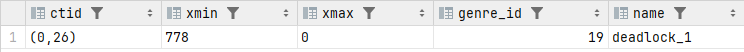

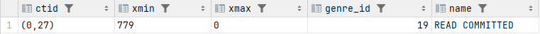

```sql
SELECT ctid, xmin, xmax, * from steam.genres;
```

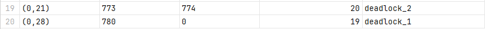

REPEATABLE READ
```sql
BEGIN TRANSACTION ISOLATION LEVEL REPEATABLE READ ;
SELECT ctid, xmin, xmax,* FROM steam.genres WHERE genres.genre_id = 19;

SELECT ctid, xmin, xmax,* FROM steam.genres WHERE genres.genre_id = 19;

UPDATE steam.genres SET name = 'REPEATABLE READ' WHERE genre_id = 19;

commit
```

```sql
BEGIN TRANSACTION ISOLATION LEVEL read committed;
UPDATE steam.genres SET name = 'READ COMMITTED' WHERE genre_id = 19;
commit;
```

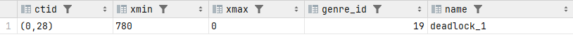

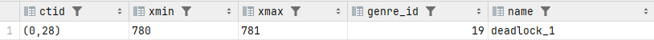

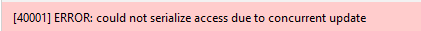

```sql
SELECT ctid, xmin, xmax, * from steam.genres;
```

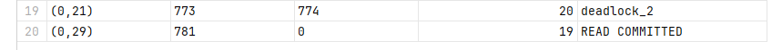


DEADLOCK
```sql
BEGIN;
UPDATE steam.genres SET name = 'new_deadlock_1' WHERE genre_id = 19;

UPDATE steam.genres SET name = 'super_new_deadlock_2' WHERE genre_id = 20;
```

```sql
BEGIN;
UPDATE steam.genres SET name = 'new_deadlock_2' WHERE genre_id = 20;

UPDATE steam.genres SET name = 'super_new_deadlock_1' WHERE genre_id = 19;
```

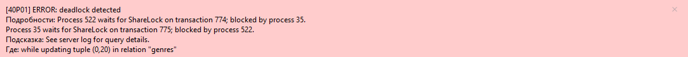

```sql
SELECT ctid, xmin, xmax, * from steam.genres;
```
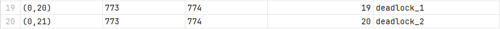

БЛОКИРОВКИ НА УРОВНЕ СТРОК

```sql
BEGIN;
SELECT * FROM steam.genres WHERE genre_id = 1 FOR UPDATE;
commit
```

```sql
BEGIN;
SELECT * FROM steam.genres WHERE genre_id = 1 FOR share ;
commit
```


```sql
BEGIN;
SELECT * FROM steam.genres WHERE genre_id = 1 FOR KEY SHARE ;
commit
```

```sql
BEGIN;
SELECT * FROM steam.genres WHERE genre_id = 1 FOR NO KEY UPDATE ;
commit
```


```sql
INSERT INTO steam.achievements (achievement_id, game_id, name, description) VALUES
(50, 50 , 'test', 'test');

BEGIN;
SELECT * FROM steam.achievements WHERE achievement_id = 50 FOR KEY SHARE;
commit
```

```sql
BEGIN;
UPDATE steam.achievements SET description = 'NO KEY UPDATE' WHERE achievement_id = 50;
commit;
```

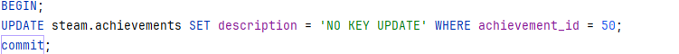

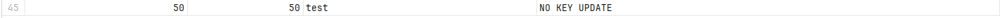

ОЧИСТКА

```sql
VACUUM (VERBOSE, ANALYZE)
```