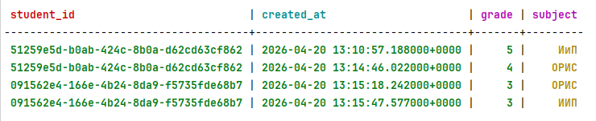
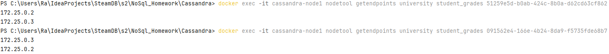
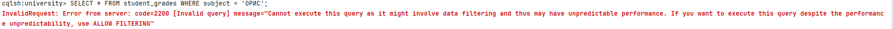
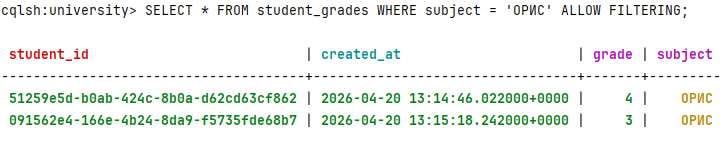

```cassandraql
CREATE KEYSPACE university
 WITH replication = {
     'class': 'SimpleStrategy',
     'replication_factor': 2
};
```

```cassandraql
CREATE TABLE student_grades (
     student_id UUID,
     created_at TIMESTAMP,
     subject TEXT,
     grade INT,
     PRIMARY KEY (student_id, created_at)
);
```







