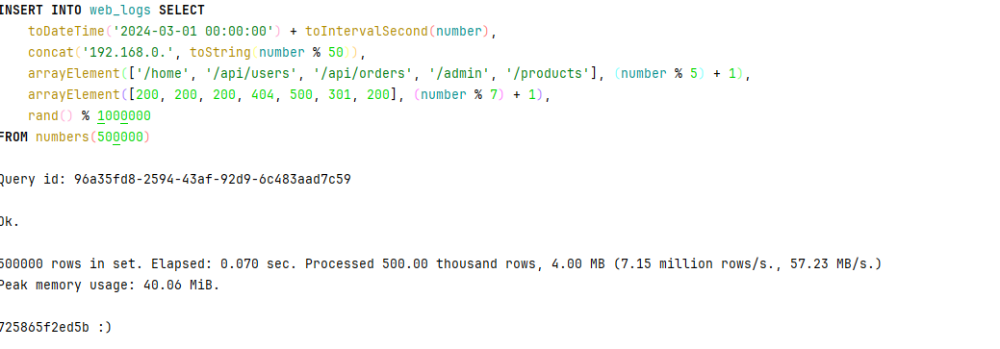
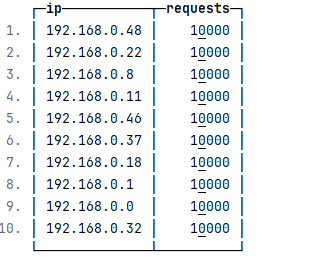
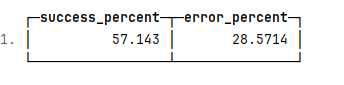
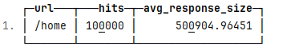
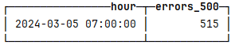
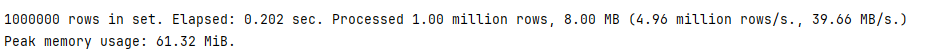

INSERT INTO web_logs
SELECT
toDateTime('2024-03-01 00:00:00') + INTERVAL number SECOND,
concat('192.168.0.', toString(number % 50)),
arrayElement(['/home', '/api/users', '/api/orders', '/admin', '/products'], number % 5 + 1),
arrayElement([200, 200, 200, 404, 500, 301, 200], number % 7 + 1),
rand() % 1000000
FROM numbers(500000);

SELECT
ip,
count() AS requests
FROM web_logs
GROUP BY ip
ORDER BY requests DESC
LIMIT 10;

SELECT
countIf(status_code BETWEEN 200 AND 299) * 100.0 / count() AS success_percent,
countIf(status_code >= 400) * 100.0 / count() AS error_percent
FROM web_logs;

SELECT
url,
count() AS hits,
avg(response_size) AS avg_response_size
FROM web_logs
GROUP BY url
ORDER BY hits DESC
LIMIT 1;

SELECT
toStartOfHour(log_time) AS hour,
count() AS errors_500
FROM web_logs
WHERE status_code = 500
GROUP BY hour
ORDER BY errors_500 DESC
LIMIT 1;

INSERT INTO sales_ch
SELECT
toDateTime('2024-01-01 00:00:00') + INTERVAL number MINUTE,
number % 1000,
arrayElement(['Electronics', 'Clothing', 'Food', 'Books'], number % 4 + 1),
rand() % 10 + 1,
round(rand() % 10000 / 100, 2),
number % 50000
FROM numbers(1000000);

