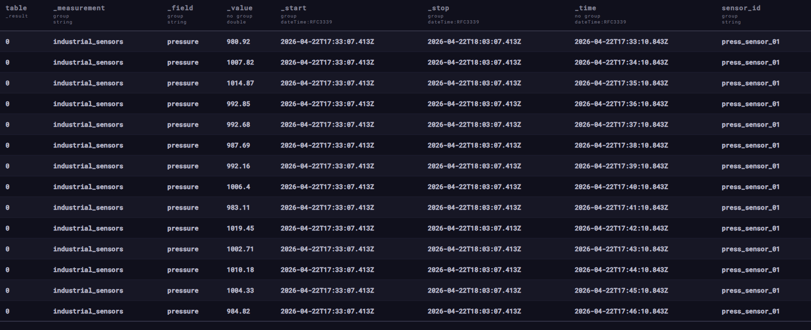
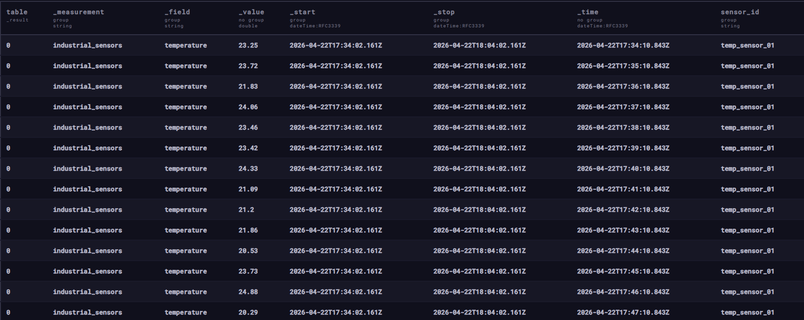
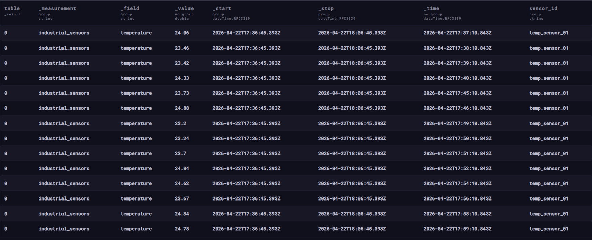
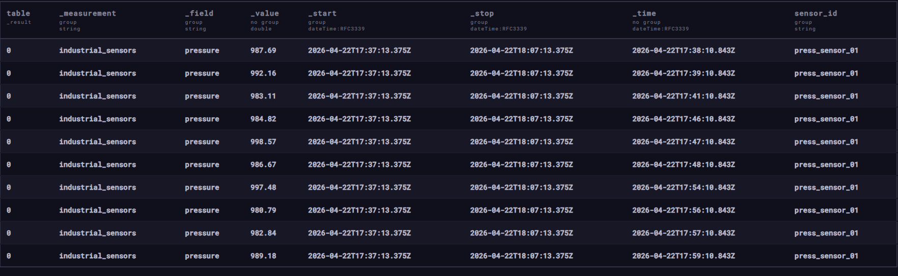
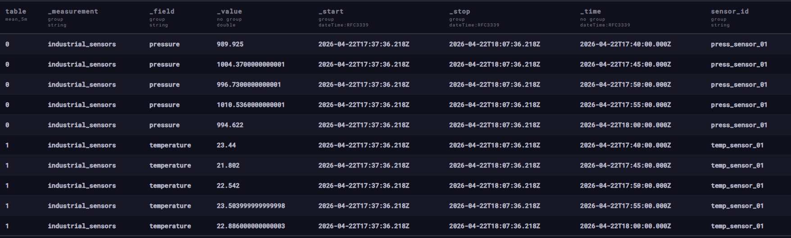
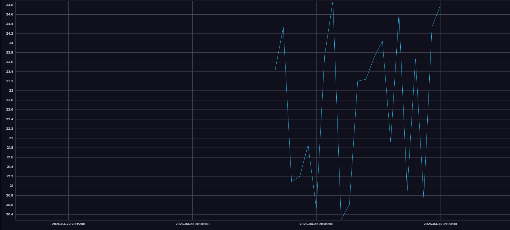
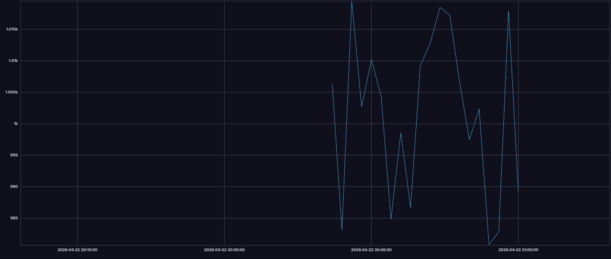

industrial_sensors,sensor_id=temp_sensor_01 temperature=22.96 1776879010843611904
industrial_sensors,sensor_id=press_sensor_01 pressure=993.37 1776879010843611904
industrial_sensors,sensor_id=temp_sensor_01 temperature=20.09 1776879070843611904
industrial_sensors,sensor_id=press_sensor_01 pressure=1015.9 1776879070843611904
industrial_sensors,sensor_id=temp_sensor_01 temperature=21.21 1776879130843611904
industrial_sensors,sensor_id=press_sensor_01 pressure=989.39 1776879130843611904
industrial_sensors,sensor_id=temp_sensor_01 temperature=24.02 1776879190843611904
industrial_sensors,sensor_id=press_sensor_01 pressure=980.92 1776879190843611904
industrial_sensors,sensor_id=temp_sensor_01 temperature=23.25 1776879250843611904
industrial_sensors,sensor_id=press_sensor_01 pressure=1007.82 1776879250843611904
industrial_sensors,sensor_id=temp_sensor_01 temperature=23.72 1776879310843611904
industrial_sensors,sensor_id=press_sensor_01 pressure=1014.87 1776879310843611904
industrial_sensors,sensor_id=temp_sensor_01 temperature=21.83 1776879370843611904
industrial_sensors,sensor_id=press_sensor_01 pressure=992.85 1776879370843611904
industrial_sensors,sensor_id=temp_sensor_01 temperature=24.06 1776879430843611904
industrial_sensors,sensor_id=press_sensor_01 pressure=992.68 1776879430843611904
industrial_sensors,sensor_id=temp_sensor_01 temperature=23.46 1776879490843611904
industrial_sensors,sensor_id=press_sensor_01 pressure=987.69 1776879490843611904
industrial_sensors,sensor_id=temp_sensor_01 temperature=23.42 1776879550843611904
industrial_sensors,sensor_id=press_sensor_01 pressure=992.16 1776879550843611904
industrial_sensors,sensor_id=temp_sensor_01 temperature=24.33 1776879610843611904
industrial_sensors,sensor_id=press_sensor_01 pressure=1006.4 1776879610843611904
industrial_sensors,sensor_id=temp_sensor_01 temperature=21.09 1776879670843611904
industrial_sensors,sensor_id=press_sensor_01 pressure=983.11 1776879670843611904
industrial_sensors,sensor_id=temp_sensor_01 temperature=21.2 1776879730843611904
industrial_sensors,sensor_id=press_sensor_01 pressure=1019.45 1776879730843611904
industrial_sensors,sensor_id=temp_sensor_01 temperature=21.86 1776879790843611904
industrial_sensors,sensor_id=press_sensor_01 pressure=1002.71 1776879790843611904
industrial_sensors,sensor_id=temp_sensor_01 temperature=20.53 1776879850843611904
industrial_sensors,sensor_id=press_sensor_01 pressure=1010.18 1776879850843611904
industrial_sensors,sensor_id=temp_sensor_01 temperature=23.73 1776879910843611904
industrial_sensors,sensor_id=press_sensor_01 pressure=1004.33 1776879910843611904
industrial_sensors,sensor_id=temp_sensor_01 temperature=24.88 1776879970843611904
industrial_sensors,sensor_id=press_sensor_01 pressure=984.82 1776879970843611904
industrial_sensors,sensor_id=temp_sensor_01 temperature=20.29 1776880030843611904
industrial_sensors,sensor_id=press_sensor_01 pressure=998.57 1776880030843611904
industrial_sensors,sensor_id=temp_sensor_01 temperature=20.61 1776880090843611904
industrial_sensors,sensor_id=press_sensor_01 pressure=986.67 1776880090843611904
industrial_sensors,sensor_id=temp_sensor_01 temperature=23.2 1776880150843611904
industrial_sensors,sensor_id=press_sensor_01 pressure=1009.26 1776880150843611904
industrial_sensors,sensor_id=temp_sensor_01 temperature=23.24 1776880210843611904
industrial_sensors,sensor_id=press_sensor_01 pressure=1012.79 1776880210843611904
industrial_sensors,sensor_id=temp_sensor_01 temperature=23.7 1776880270843611904
industrial_sensors,sensor_id=press_sensor_01 pressure=1018.51 1776880270843611904
industrial_sensors,sensor_id=temp_sensor_01 temperature=24.04 1776880330843611904
industrial_sensors,sensor_id=press_sensor_01 pressure=1017.25 1776880330843611904
industrial_sensors,sensor_id=temp_sensor_01 temperature=21.92 1776880390843611904
industrial_sensors,sensor_id=press_sensor_01 pressure=1006.65 1776880390843611904
industrial_sensors,sensor_id=temp_sensor_01 temperature=24.62 1776880450843611904
industrial_sensors,sensor_id=press_sensor_01 pressure=997.48 1776880450843611904
industrial_sensors,sensor_id=temp_sensor_01 temperature=20.89 1776880510843611904
industrial_sensors,sensor_id=press_sensor_01 pressure=1002.37 1776880510843611904
industrial_sensors,sensor_id=temp_sensor_01 temperature=23.67 1776880570843611904
industrial_sensors,sensor_id=press_sensor_01 pressure=980.79 1776880570843611904
industrial_sensors,sensor_id=temp_sensor_01 temperature=20.75 1776880630843611904
industrial_sensors,sensor_id=press_sensor_01 pressure=982.84 1776880630843611904
industrial_sensors,sensor_id=temp_sensor_01 temperature=24.34 1776880690843611904
industrial_sensors,sensor_id=press_sensor_01 pressure=1017.93 1776880690843611904
industrial_sensors,sensor_id=temp_sensor_01 temperature=24.78 1776880750843611904
industrial_sensors,sensor_id=press_sensor_01 pressure=989.18 1776880750843611904

from(bucket: "hw_sensors")
|> range(start: -1h)
|> filter(fn: (r) => r["_field"] == "temperature" or r["_field"] == "pressure")

from(bucket: "hw_sensors")
|> range(start: -30m)
|> filter(fn: (r) => r["_measurement"] == "industrial_sensors")
|> filter(fn: (r) => r["sensor_id"] == "temp_sensor_01")

from(bucket: "hw_sensors")
|> range(start: -30m)
|> filter(fn: (r) => r["_measurement"] == "industrial_sensors")
|> filter(fn: (r) => r["sensor_id"] == "temp_sensor_01")
|> filter(fn: (r) => r["_field"] == "temperature")
|> max()

from(bucket: "hw_sensors")
|> range(start: -30m)
|> filter(fn: (r) => r["_measurement"] == "industrial_sensors")
|> filter(fn: (r) => r["sensor_id"] == "press_sensor_01")
|> filter(fn: (r) => r["_field"] == "pressure")
|> mean()

from(bucket: "hw_sensors")
|> range(start: -30m)
|> filter(fn: (r) => r["_measurement"] == "industrial_sensors")
|> filter(fn: (r) => r["_field"] == "temperature")
|> filter(fn: (r) => r["_value"] > 23.0)

from(bucket: "hw_sensors")
|> range(start: -30m)
|> filter(fn: (r) => r["_measurement"] == "industrial_sensors")
|> filter(fn: (r) => r["_field"] == "pressure")
|> filter(fn: (r) => r["_value"] < 1000.0)

from(bucket: "hw_sensors")
|> range(start: -30m)
|> filter(fn: (r) => r["_measurement"] == "industrial_sensors")
|> aggregateWindow(every: 5m, fn: mean, createEmpty: false)
|> yield(name: "mean_5m")

from(bucket: "hw_sensors")
|> range(start: -30m)
|> filter(fn: (r) => r["_measurement"] == "industrial_sensors")
|> filter(fn: (r) => r["_field"] == "temperature")
|> filter(fn: (r) => r["sensor_id"] == "temp_sensor_01")
|> aggregateWindow(every: 1m, fn: mean, createEmpty: false)

from(bucket: "hw_sensors")
|> range(start: -30m)
|> filter(fn: (r) => r["_measurement"] == "industrial_sensors")
|> filter(fn: (r) => r["_field"] == "pressure")
|> filter(fn: (r) => r["sensor_id"] == "press_sensor_01")
|> aggregateWindow(every: 1m, fn: mean, createEmpty: false)

