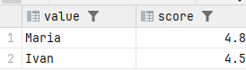
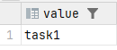
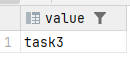
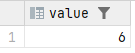
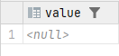
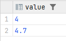
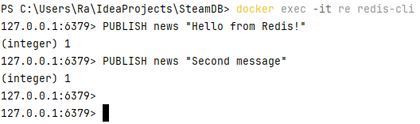
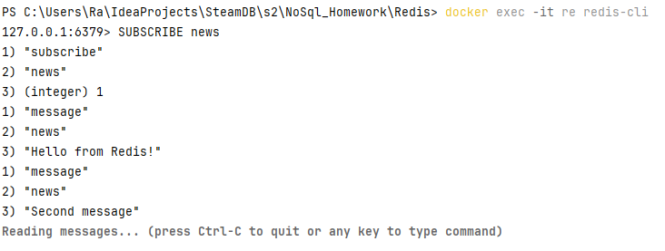

HSET student:1 name "Ivan" group "11-421" gpa 4.5
HSET student:2 name "Maria" group "11-421" gpa 4.8
HSET student:3 name "Denis" group "11-421" gpa 4.2

HGETALL student:1
HGETALL student:2
HGETALL student:3

ZADD gpa_leaderboard 4.5 "Ivan"
ZADD gpa_leaderboard 4.8 "Maria"
ZADD gpa_leaderboard 4.2 "Denis"

ZREVRANGE gpa_leaderboard 0 1 WITHSCORES

RPUSH tasks "task1"
RPUSH tasks "task2"
RPUSH tasks "task3"
RPUSH tasks "task4"
RPUSH tasks "task5"

LPOP tasks

SET key "Ivan" EX 10

TTL key

GET key

MULTI

HINCRBYFLOAT student:1 gpa -0.5

HINCRBYFLOAT student:3 gpa 0.5

EXEC

SUBSCRIBE news

PUBLISH news "Hello from Redis!"

PUBLISH news "Second message"

