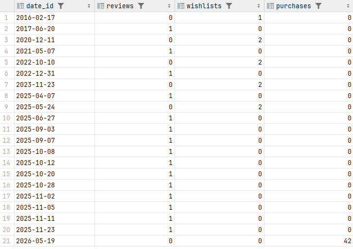
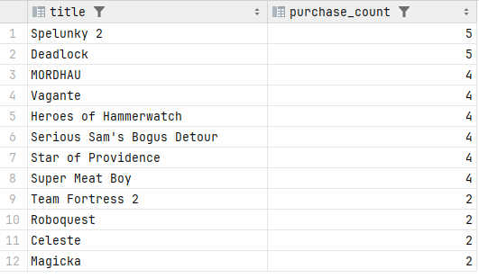
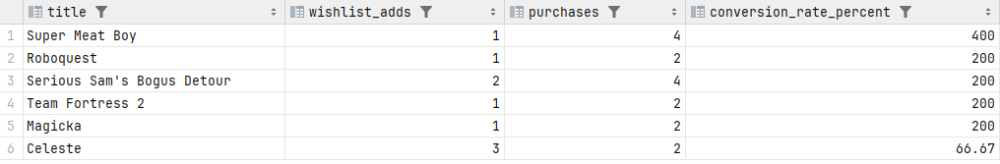

1) Сколько отзывов, добавлений в вишлист и покупок делают пользователи каждый день и для каких игр?
2) Как отзывы и вишлисты конвертируются в количество покупок?
3) Какие игры самые популярные?


```sql
CREATE SCHEMA IF NOT EXISTS olap;

CREATE TABLE olap.dim_date (
date_id      DATE PRIMARY KEY,
day          INT NOT NULL,
month        INT NOT NULL,
year         INT NOT NULL,
day_of_week  INT NOT NULL,
is_weekend   BOOLEAN NOT NULL
);

INSERT INTO olap.dim_date (date_id, day, month, year, day_of_week, is_weekend)
SELECT
d::DATE,
EXTRACT(DAY FROM d)::INT,
EXTRACT(MONTH FROM d)::INT,
EXTRACT(YEAR FROM d)::INT,
EXTRACT(DOW FROM d)::INT,
EXTRACT(DOW FROM d) IN (0, 6)
FROM generate_series(
LEAST(
(SELECT MIN(review_date) FROM steam.reviews),
(SELECT MIN(added_date) FROM steam.wishlists),
(SELECT MIN(purchase_date) FROM steam.account_game WHERE purchase_date IS NOT NULL)
)::DATE,
CURRENT_DATE,
'1 day'::INTERVAL
) AS d;

CREATE TABLE olap.dim_account (
account_id     INT PRIMARY KEY,
username       VARCHAR(200) NOT NULL,
email          VARCHAR(50)  NOT NULL,
wallet_balance INT          NOT NULL
);

INSERT INTO olap.dim_account (account_id, username, email, wallet_balance)
SELECT account_id, username, email, wallet_balance
FROM steam.accounts;

CREATE TABLE olap.dim_game (
game_id        INT PRIMARY KEY,
title          VARCHAR(200) NOT NULL,
developer_name VARCHAR(100),
genres         TEXT,
price          INT NOT NULL DEFAULT 0,
release_date   DATE
);

INSERT INTO olap.dim_game (game_id, title, developer_name, genres, price, release_date)
SELECT
g.game_id,
g.title,
d.name AS developer_name,
(SELECT STRING_AGG(gen.name, ', ' ORDER BY gen.name)
FROM steam.game_genre gg
JOIN steam.genres gen ON gg.genre_id = gen.genre_id
WHERE gg.game_id = g.game_id) AS genres,
g.price,
g.release_date
FROM steam.games g
JOIN steam.developers d ON g.developer_id = d.developer_id;

CREATE TABLE olap.dim_action_type (
action_type_id SERIAL PRIMARY KEY,
action_name    VARCHAR(20) UNIQUE NOT NULL
);

INSERT INTO olap.dim_action_type (action_name) VALUES ('review'), ('wishlist'), ('purchase');

CREATE TABLE olap.fact_user_actions (
action_id      BIGSERIAL PRIMARY KEY,
date_id        DATE NOT NULL REFERENCES olap.dim_date(date_id),
account_id     INT NOT NULL REFERENCES olap.dim_account(account_id),
game_id        INT NOT NULL REFERENCES olap.dim_game(game_id),
action_type_id INT NOT NULL REFERENCES olap.dim_action_type(action_type_id),
rating         BOOLEAN
);

INSERT INTO olap.fact_user_actions (date_id, account_id, game_id, action_type_id, rating)
SELECT
r.review_date,
r.account_id,
r.game_id,
(SELECT action_type_id FROM olap.dim_action_type WHERE action_name = 'review'),
r.rating
FROM steam.reviews r;

INSERT INTO olap.fact_user_actions (date_id, account_id, game_id, action_type_id, rating)
SELECT
w.added_date,
w.account_id,
w.game_id,
(SELECT action_type_id FROM olap.dim_action_type WHERE action_name = 'wishlist'),
NULL
FROM steam.wishlists w;

INSERT INTO olap.fact_user_actions (date_id, account_id, game_id, action_type_id, rating)
SELECT
ag.purchase_date,
ag.account_id,
ag.game_id,
(SELECT action_type_id FROM olap.dim_action_type WHERE action_name = 'purchase'),
NULL
FROM steam.account_game ag;
```

```sql
SELECT
d.date_id,
COUNT(CASE WHEN a.action_name = 'review'   THEN 1 END) AS reviews,
COUNT(CASE WHEN a.action_name = 'wishlist' THEN 1 END) AS wishlists,
COUNT(CASE WHEN a.action_name = 'purchase' THEN 1 END) AS purchases
FROM olap.dim_date d
JOIN olap.fact_user_actions f ON d.date_id = f.date_id
JOIN olap.dim_action_type a ON f.action_type_id = a.action_type_id
GROUP BY d.date_id
ORDER BY d.date_id;
```



```sql
SELECT
g.title,
COUNT(*) AS purchase_count
FROM olap.fact_user_actions f
JOIN olap.dim_game g ON f.game_id = g.game_id
JOIN olap.dim_action_type a ON f.action_type_id = a.action_type_id
WHERE a.action_name = 'purchase'
GROUP BY g.title
ORDER BY purchase_count DESC;
```


```sql
SELECT
g.title,
COUNT(CASE WHEN a.action_name = 'wishlist' THEN 1 END)  AS wishlist_adds,
COUNT(CASE WHEN a.action_name = 'purchase' THEN 1 END)  AS purchases,
CASE
WHEN COUNT(CASE WHEN a.action_name = 'wishlist' THEN 1 END) > 0
THEN ROUND(
100.0 * COUNT(CASE WHEN a.action_name = 'purchase' THEN 1 END)
/ COUNT(CASE WHEN a.action_name = 'wishlist' THEN 1 END), 2
)
END AS conversion_rate_percent
FROM olap.fact_user_actions f
JOIN olap.dim_game g ON f.game_id = g.game_id
JOIN olap.dim_action_type a ON f.action_type_id = a.action_type_id
GROUP BY g.title
HAVING COUNT(CASE WHEN a.action_name = 'wishlist' THEN 1 END) > 0
ORDER BY conversion_rate_percent DESC;
```

