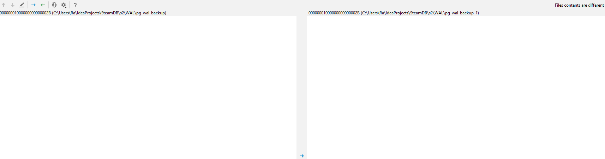
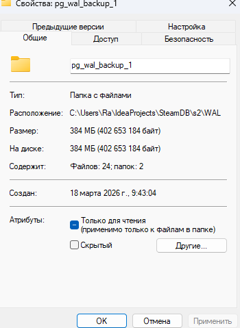
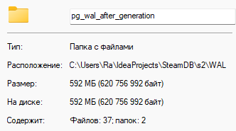
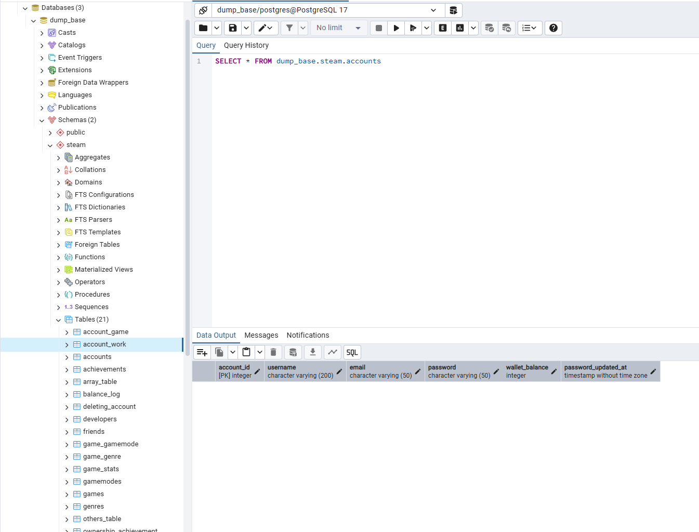
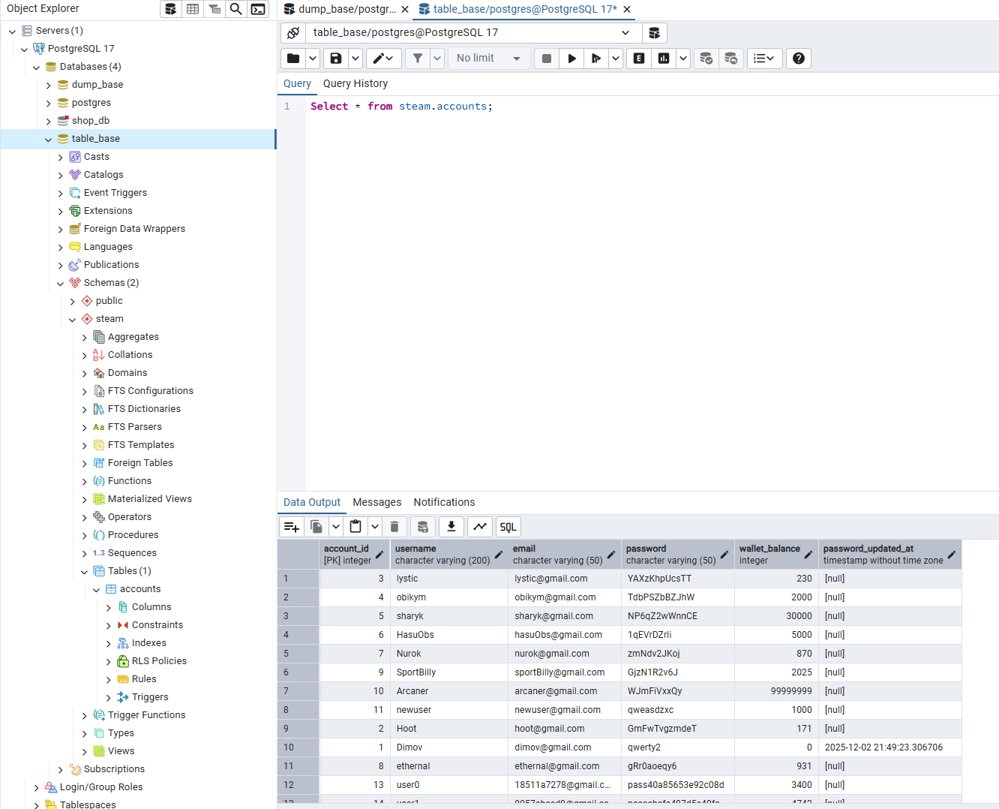

SELECT pg_current_wal_lsn();

INSERT INTO steam.developers(name) VALUES ('new_developers')

SELECT pg_current_wal_lsn();

SELECT pg_current_wal_lsn();

INSERT INTO steam.developers(name) VALUES ('new_developers');

SELECT pg_current_wal_lsn();

BEGIN;
INSERT INTO steam.developers(name) VALUES ('new_developers_1');
commit;

INSERT INTO steam.accounts (username, email, password, wallet_balance) SELECT
'user' || gs,
LEFT(md5(random()::varchar), 10) || '@gmail.com',
'pass' || LEFT(md5(random()::varchar), 15),
(random()*5000)::int
FROM generate_series(300000, 5500000) as gs;

pg_dump -h localhost -p 5433 -U postgres -Fc -s -d steamDB -f C:\Users\Ra\IdeaProjects\SteamDB\structure_only.dump

pg_restore -h localhost -p 5432 -U postgres -d dump_base -Fc structure_only.dump   

pg_dump -h localhost -p 5433 -U postgres -Fc -d steamDB -n steam -t steam.accounts -f C:\Users\Ra\IdeaProjects\SteamDB\table_only.dump

pg_restore -h localhost -p 5432 -U postgres -d table_base -t steam.accounts  -Fc table_only.dump
