```sql
CREATE INDEX idx_str_array
ON steam.array_table
USING GIN (str_array);
```

```sql
EXPLAIN (ANALYSE,BUFFERS) SELECT id, str_array FROM steam.array_table
WHERE str_array && ARRAY['5db54cf433', 'ae6637c4ab']::varchar[];
```

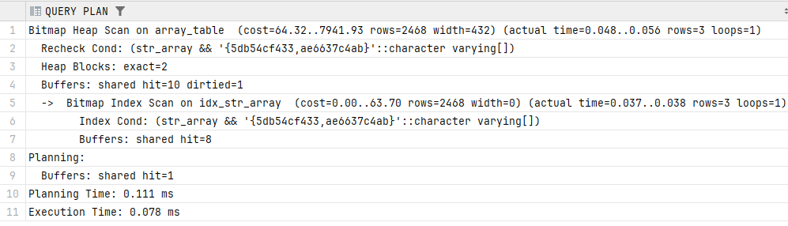

```sql
EXPLAIN (ANALYSE,BUFFERS) INSERT INTO steam.array_table(int_array_20, int_array, str_array_20, str_array, date_array)
VALUES (
ARRAY[1,2,3],
ARRAY[1,2,3],
ARRAY['5db54cf433', 'ae6637c4ab'],
ARRAY['5db54cf433', 'ae6637c4ab']::varchar[],
ARRAY['2021-12-12']);
```

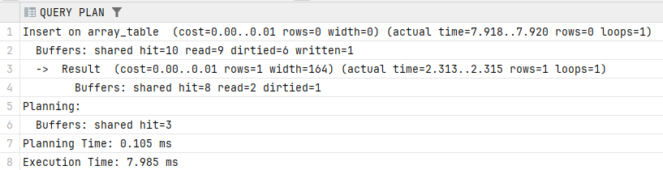

```sql
CREATE INDEX idx_int_array
ON steam.array_table
USING GIN (int_array);
```

```sql
EXPLAIN (ANALYSE,BUFFERS) SELECT id, int_array FROM steam.array_table
WHERE int_array = ARRAY[150288,191703,929457,396440,8281,264742,499755,797973,859886,894473,345173,64738,333223,416753,667065,788827,352538,620093,451883,298985,887515,956644,750853,941471,980678,688432,604062,872964,6842,249046]::integer[];
```

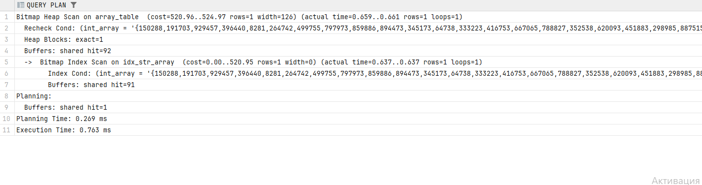

```sql
EXPLAIN (ANALYSE,BUFFERS) SELECT int_array FROM steam.array_table
WHERE int_array[1] IN (150288,191703);
```

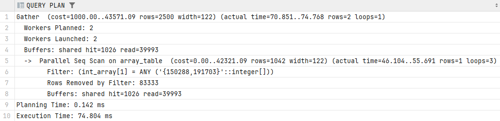

```sql
DROP INDEX steam.idx_int_array;
```

```sql
CREATE INDEX idx_date_array
ON steam.array_table
USING GIN (date_array);
```

```sql
EXPLAIN (ANALYSE,BUFFERS) SELECT id, date_array FROM steam.array_table
WHERE date_array = ARRAY['2025-04-02'::date,'2023-08-15'::date];
```

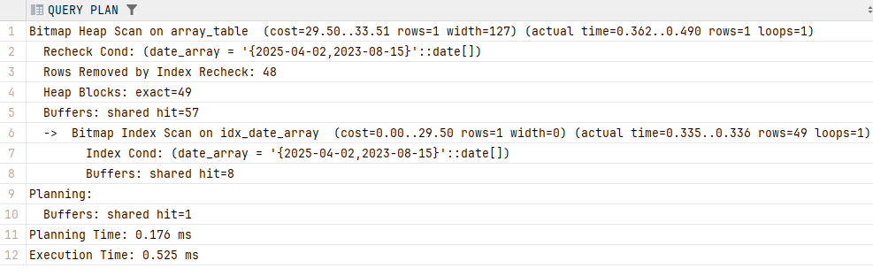
```sql
DROP INDEX steam.idx_date_array;
```

```sql
CREATE INDEX idx_int_range
ON steam.others_table
USING GIST (range_int);
```

```sql
EXPLAIN (ANALYSE,BUFFERS) SELECT id, range_int from steam.others_table
WHERE range_int @> '[61000, 61003]'::int4range;
```

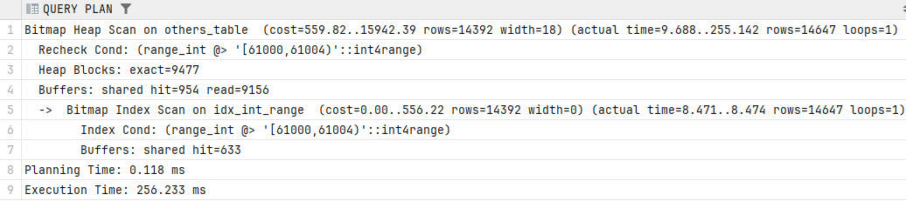

```sql
EXPLAIN (ANALYSE, BUFFERS) INSERT INTO steam.others_table (fld_point, fld_line, full_text, range_int)
VALUES
(point(1,2),
format('{%s, %s, %s}',
1,
1,
1)::line,
'ab df gh'::tsvector,
int4range(1, 12));
```

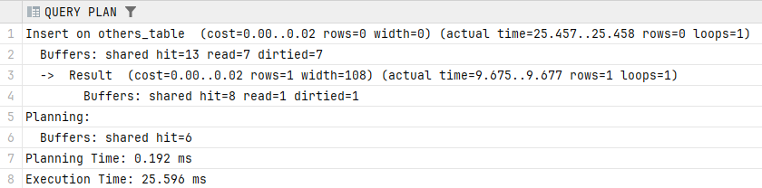

```sql
CREATE INDEX idx_int_range
ON steam.others_table
USING GIST (fld_point);
```

```sql
EXPLAIN (ANALYSE,BUFFERS) SELECT id, fld_point from steam.others_table
WHERE others_table.fld_point ~= ANY (array[point(214665.0,230942.0), point(415865.0,651221.0)]);
```

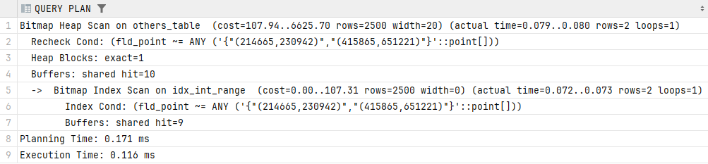

```sql
EXPLAIN (ANALYSE,BUFFERS)SELECT id, fld_point from steam.others_table
ORDER BY fld_point <-> point(0,0)
LIMIT 3;
```

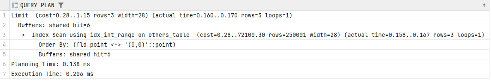

```sql
DROP INDEX steam.idx_int_range;
```

```sql
CREATE INDEX idx_full_text
ON steam.others_table
USING GIST (full_text);
```

```sql
EXPLAIN (ANALYSE,BUFFERS) SELECT id, full_text from steam.others_table
WHERE full_text @@ to_tsquery('04 | 01808');
```

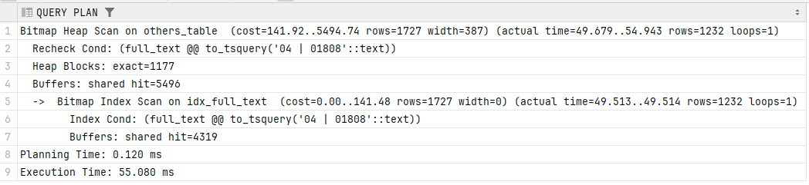

```sql
DROP INDEX steam.idx_full_text;
```

```sql
EXPLAIN (ANALYSE, BUFFERS) SELECT d.name, games.title FROM steam.games
JOIN steam.developers d on d.developer_id = games.developer_id;
```

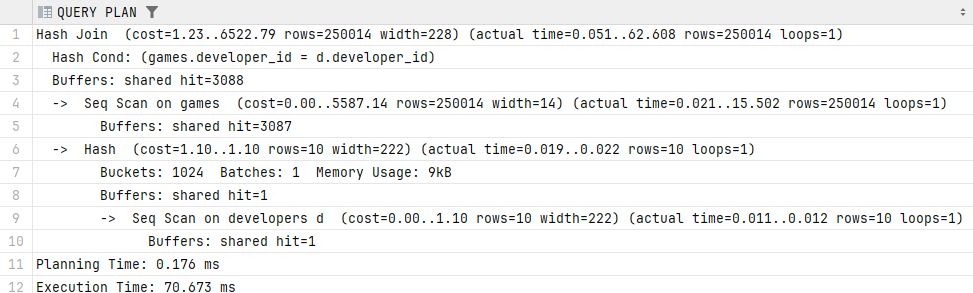

```sql
CREATE INDEX reviews_index_1
ON steam.reviews(game_id);
```


```sql
EXPLAIN (ANALYSE, BUFFERS ) SELECT  games.title, reviews.comment  FROM steam.games JOIN steam.reviews
ON games.game_id = reviews.game_id;
```

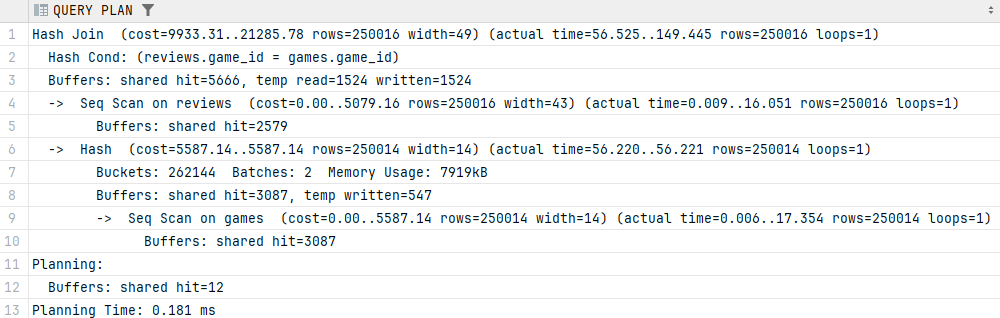

```
EXPLAIN (ANALYSE, BUFFERS) SELECT * FROM steam.games JOIN
steam.accounts On steam.accounts.account_id = games.game_id;
```

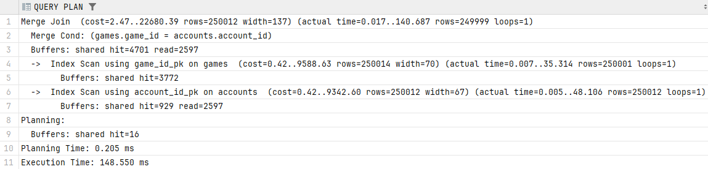

```sql
EXPLAIN (ANALYSE, BUFFERS ) SELECT * FROM steam.games JOIN steam.game_genre ON steam.game_genre.game_id = games.game_id;
```

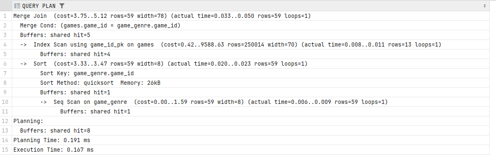

```sql
EXPLAIN (ANALYSE, BUFFERS ) SELECT  a.username, games.title, reviews.comment  FROM steam.games JOIN steam.reviews
ON games.game_id = reviews.game_id JOIN steam.accounts a on a.account_id = reviews.account_id;
```

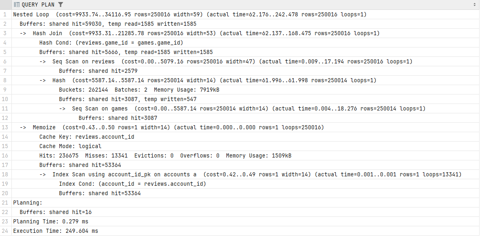

```sql
EXPLAIN (ANALYSE, BUFFERS ) SELECT * FROM steam.games JOIN steam.developers ON games.game_id = developers.developer_id;
```

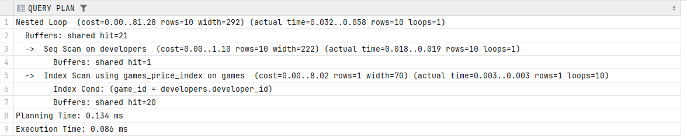