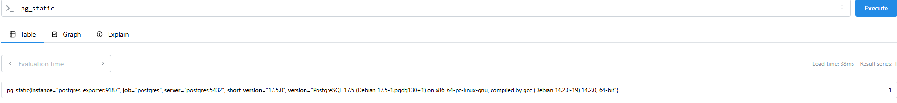
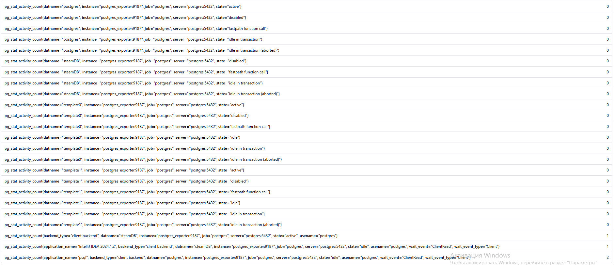
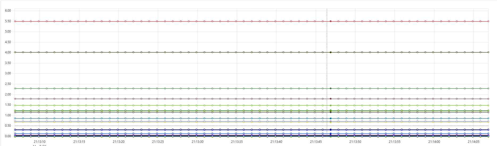
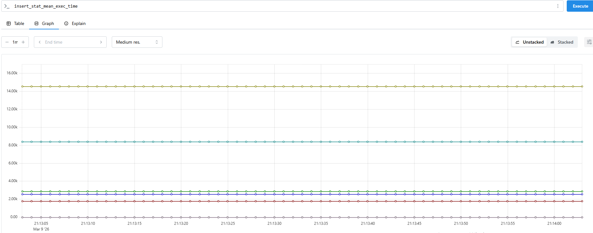
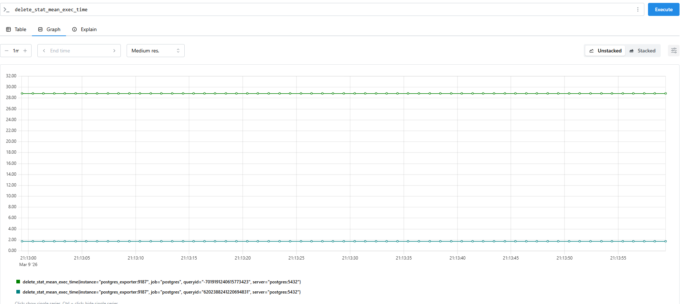
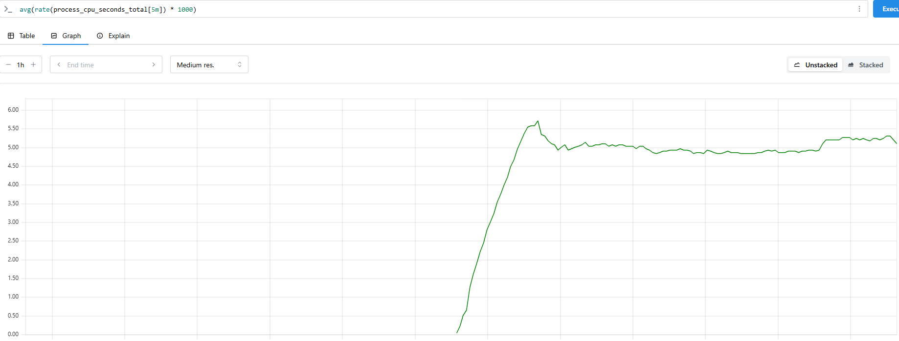

версия postgres

активные сессии

график с SELECT

график с INSERT

график с DELETE

Аverage CPU Usage (avg(rate(process_cpu_seconds_total{release="$release", instance="$instance"}[5m]) * 1000))

