EXPLAIN ANALYSE SELECT * FROM steam.games WHERE price = 100;

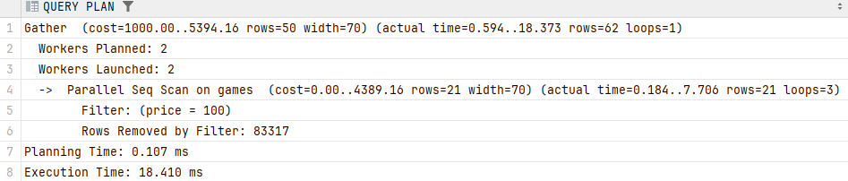

EXPLAIN (ANALYSE, BUFFERS)  SELECT * FROM steam.games WHERE price = 100;

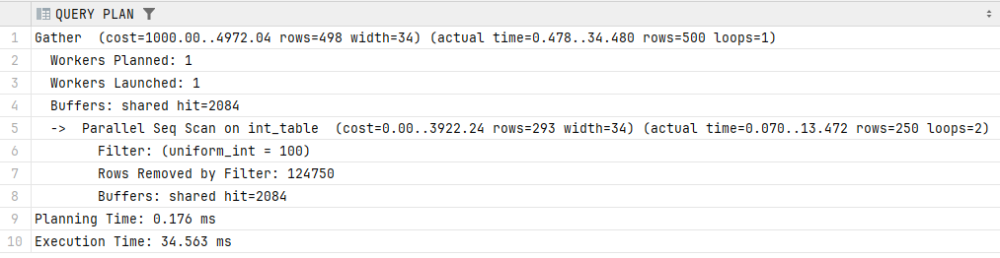

CREATE INDEX games_price_index ON steam.games (price);

EXPLAIN ANALYSE SELECT * FROM steam.games WHERE price = 100;

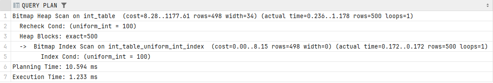

EXPLAIN (ANALYSE, BUFFERS)  SELECT * FROM steam.games WHERE price = 100;

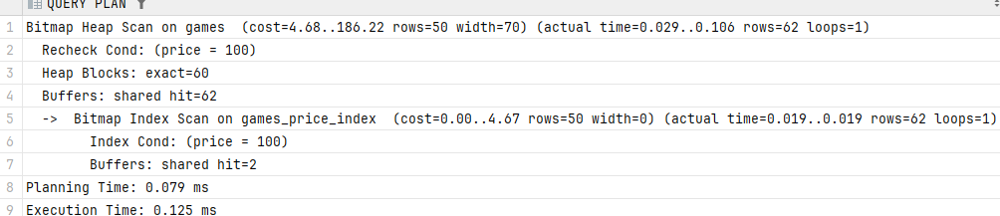

DROP INDEX steam.games_price_index;

CREATE INDEX games_price_index_hash ON steam.games USING hash (price);

EXPLAIN ANALYSE SELECT * FROM steam.games WHERE price = 100;

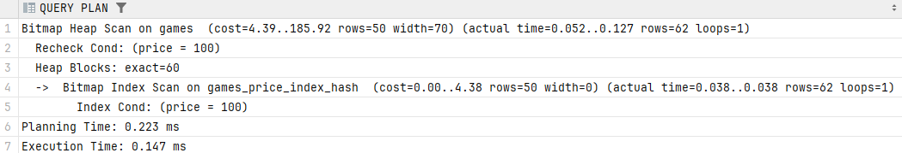

EXPLAIN (ANALYSE, BUFFERS)  SELECT * FROM steam.games WHERE price = 100;

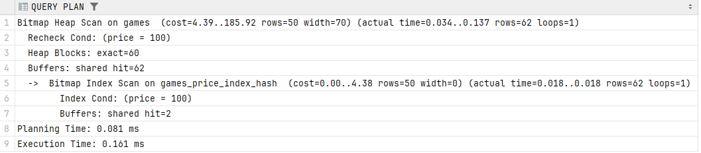

DROP INDEX steam.games_price_index_hash;

EXPLAIN ANALYSE SELECT * FROM steam.games WHERE price < 100;

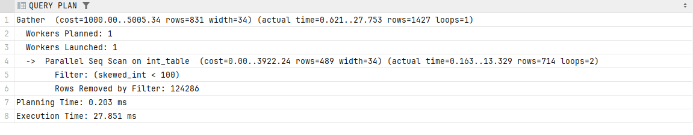

EXPLAIN (ANALYSE, BUFFERS)  SELECT * FROM steam.games WHERE price < 100;

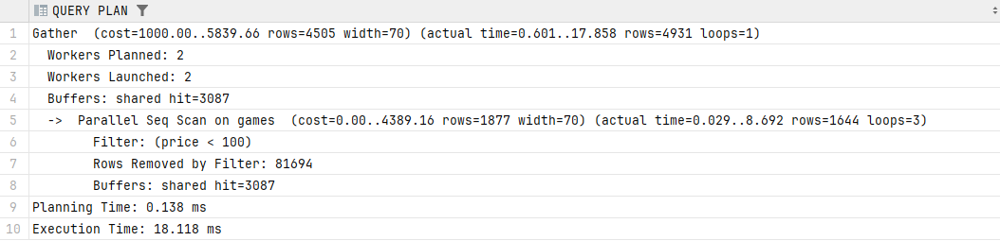

CREATE INDEX games_price_index ON steam.games (price);

EXPLAIN ANALYSE SELECT * FROM steam.games WHERE price < 100;

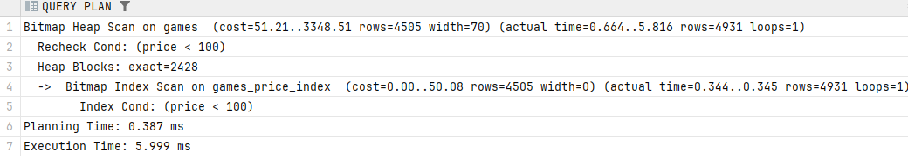

EXPLAIN (ANALYSE, BUFFERS)  SELECT * FROM steam.games WHERE price < 100;

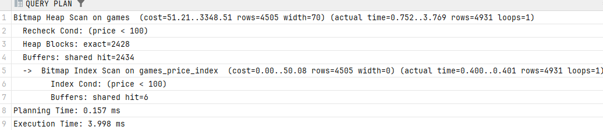

DROP INDEX steam.games_price_index;

CREATE INDEX games_price_index_hash ON steam.games USING hash (price);

EXPLAIN ANALYSE SELECT * FROM steam.games WHERE price < 100;

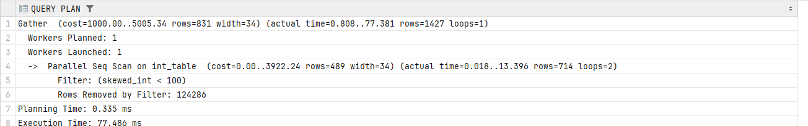

EXPLAIN (ANALYSE, BUFFERS)  SELECT * FROM steam.games WHERE price < 100;

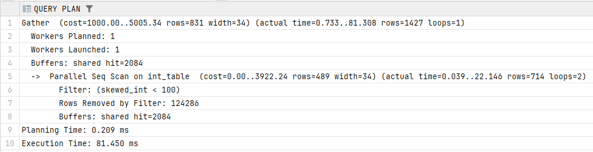

DROP INDEX steam.games_price_index_hash;

EXPLAIN ANALYSE SELECT * FROM steam.games WHERE games.price IN (2, 3, 5);

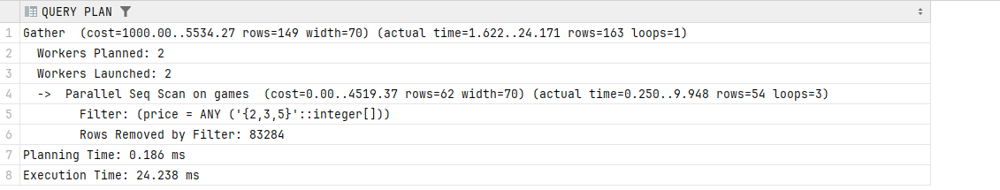

EXPLAIN (ANALYSE, BUFFERS)  SELECT * FROM steam.games WHERE games.price IN (2, 3, 5);

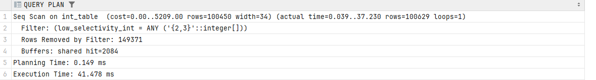

CREATE INDEX games_price_index ON steam.games (price);

EXPLAIN ANALYSE SELECT * FROM steam.games WHERE games.price IN (2, 3, 5);

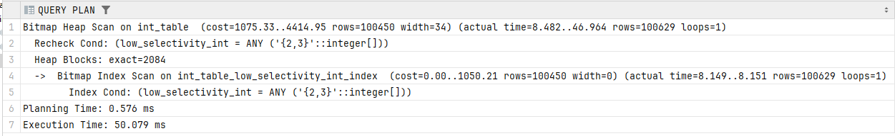

EXPLAIN (ANALYSE, BUFFERS)  SELECT * FROM steam.games WHERE games.price IN (2, 3, 5);

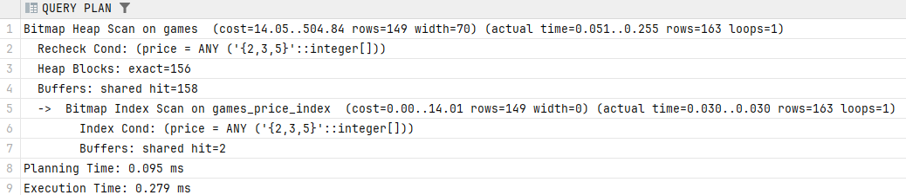

DROP INDEX steam.games_price_index;

CREATE INDEX games_price_index_hash ON steam.games USING hash (price);

EXPLAIN ANALYSE SELECT * FROM steam.games WHERE games.price IN (2, 3, 5);

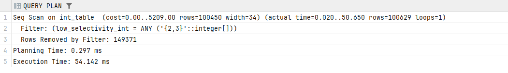

EXPLAIN (ANALYSE, BUFFERS)  SELECT * FROM steam.games WHERE games.price IN (2, 3, 5);

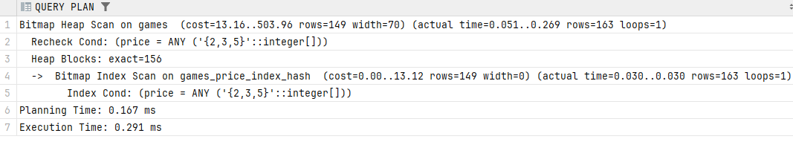

DROP INDEX steam.games_price_index_hash;

EXPLAIN ANALYSE SELECT * FROM steam.games WHERE games.price BETWEEN 3000 AND 4000;

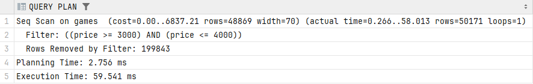

EXPLAIN (ANALYSE, BUFFERS)  SELECT * FROM steam.games WHERE games.price BETWEEN 3000 AND 4000;

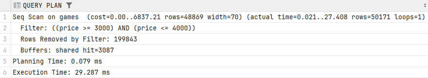

CREATE INDEX games_price_index ON steam.games (price);

EXPLAIN ANALYSE SELECT * FROM steam.games WHERE games.price BETWEEN 3000 AND 4000;

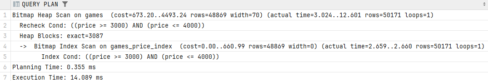

EXPLAIN (ANALYSE, BUFFERS)  SELECT * FROM steam.games WHERE games.price BETWEEN 3000 AND 4000;

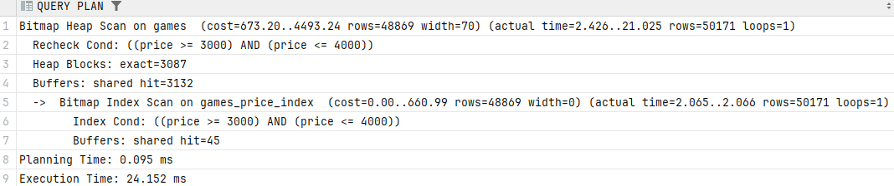

DROP INDEX steam.games_price_index;

CREATE INDEX games_price_index_hash ON steam.games USING hash(price);

EXPLAIN ANALYSE SELECT * FROM steam.games WHERE games.price BETWEEN 3000 AND 4000;

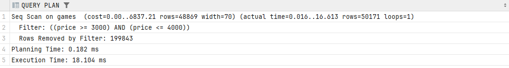

EXPLAIN (ANALYSE, BUFFERS)  SELECT * FROM steam.games WHERE games.price BETWEEN 3000 AND 4000;

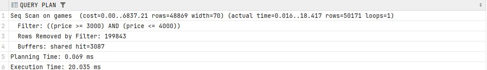

DROP INDEX steam.games_price_index_hash;

EXPLAIN ANALYSE SELECT * FROM steam.reviews WHERE reviews.rating <> true;

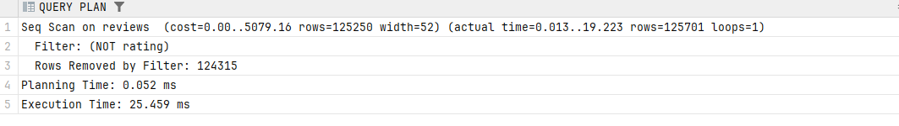

EXPLAIN (ANALYSE, BUFFERS)  SELECT * FROM steam.reviews WHERE reviews.rating <> true;

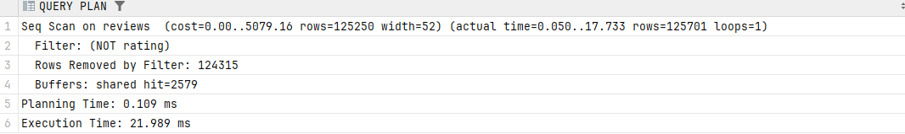

CREATE INDEX reviews_rating_index ON steam.reviews (rating);

EXPLAIN ANALYSE SELECT * FROM steam.reviews WHERE reviews.rating <> true;

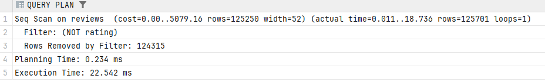

EXPLAIN (ANALYSE, BUFFERS)  SELECT * FROM steam.reviews WHERE reviews.rating <> true;

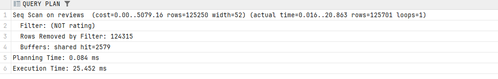

DROP INDEX steam.reviews_rating_index;

CREATE INDEX reviews_rating_index_hash ON steam.reviews USING hash(rating);

EXPLAIN ANALYSE SELECT * FROM steam.reviews WHERE reviews.rating <> true;

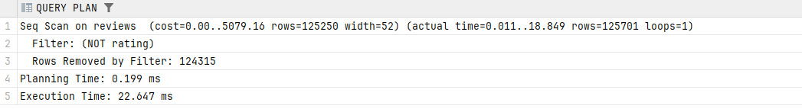

EXPLAIN (ANALYSE, BUFFERS)  SELECT * FROM steam.reviews WHERE reviews.rating <> true;

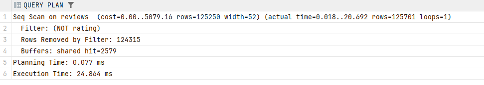

DROP INDEX steam.reviews_rating_index_hash;