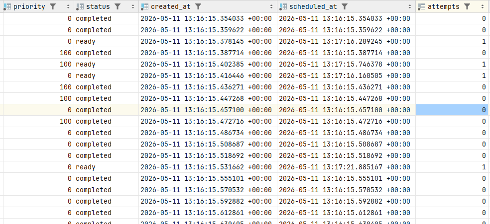
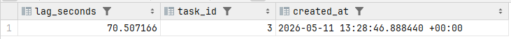
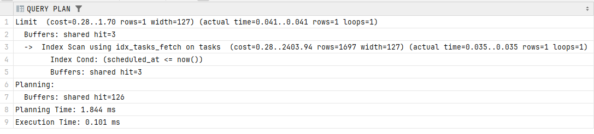
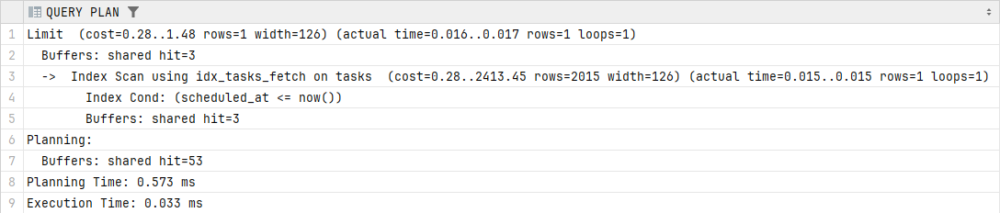
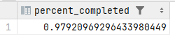
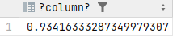

1 Создание таблицы

```sql
CREATE TABLE IF NOT EXISTS steam.tasks (
task_id         BIGSERIAL PRIMARY KEY,
task_type       VARCHAR(50)   NOT NULL,
payload         JSONB         NOT NULL,
priority        INT           NOT NULL DEFAULT 0,
status          VARCHAR(20)   NOT NULL DEFAULT 'ready',
created_at      TIMESTAMPTZ   NOT NULL DEFAULT NOW(),
scheduled_at    TIMESTAMPTZ   NOT NULL DEFAULT NOW(),
attempts        INT           NOT NULL DEFAULT 0,
max_attempts    INT           NOT NULL DEFAULT 3,
last_error      TEXT          NULL,
started_at      TIMESTAMPTZ   NULL,
completed_at    TIMESTAMPTZ   NULL
);


CREATE INDEX IF NOT EXISTS idx_tasks_fetch
ON steam.tasks (priority DESC, scheduled_at ASC)
WHERE status = 'ready';

CREATE INDEX IF NOT EXISTS idx_tasks_lag
ON steam.tasks (created_at)
WHERE status = 'ready';
```


Выполняется примерно 15 задач в секунду.


2 Вычисление лага

```sql
SELECT 
    EXTRACT(EPOCH FROM (NOW() - created_at)) AS lag_seconds,
    task_id,
    created_at
FROM steam.tasks
WHERE status = 'ready'
ORDER BY created_at ASC
LIMIT 1;
```




3 Autovacuum(Увеличил скорость создания задач до 500 и скорость завершения задач до 200 задач двумя consumer)
```sql
VACUUM ANALYSE 
```
ДО




ПОСЛЕ



```sql
WITH co AS (
    SELECT COUNT(*) AS total
    FROM steam.tasks
    WHERE priority = 100
)
SELECT COUNT(*) * 1.0 / co.total as percent_completed
FROM steam.tasks, co
WHERE priority = 100 AND status = 'completed'
GROUP BY co.total;
```




```sql
WITH co AS (
    SELECT COUNT(*) AS total
    FROM steam.tasks
    WHERE priority = 0
)
SELECT COUNT(*) * 1.0 / co.total
FROM steam.tasks, co
WHERE priority = 0 AND status = 'completed'
GROUP BY co.total;
```

