Архитектура
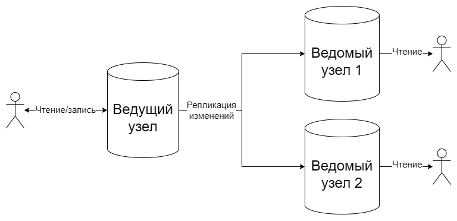


Вставка на мастере
```sql
INSERT INTO steam.genres(name) VALUES ('REPLICA');
```
```sql
SELECT * from steam.genres;
```
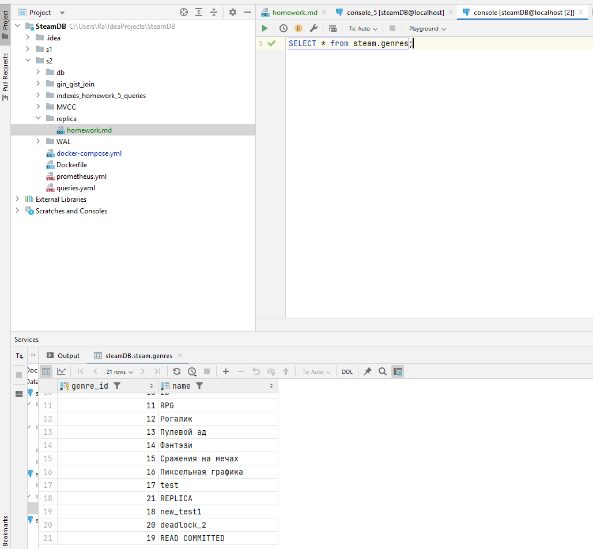

Вставка на реплике
```sql
INSERT INTO steam.genres(name) VALUES ('REPLICA_ON_REPLICA');
```
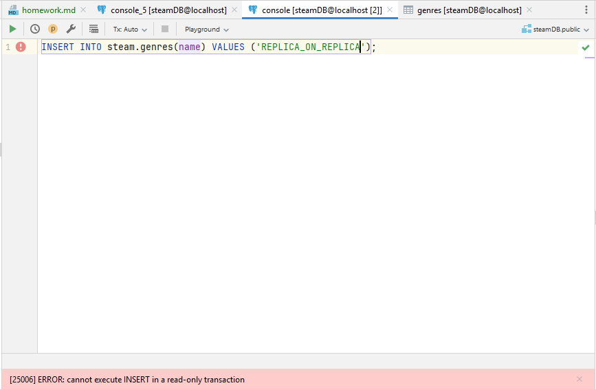

Анализ lag

while ($true) {
docker exec postgres psql -U postgres -d steamDB -c "SELECT application_name, write_lag, flush_lag, replay_lag FROM pg_stat_replication;"
Start-Sleep -Seconds 5
}

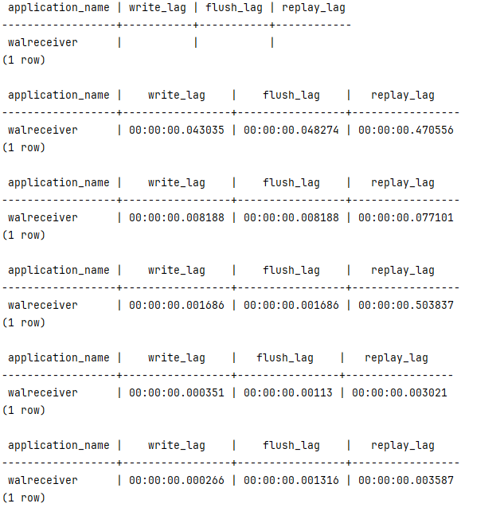

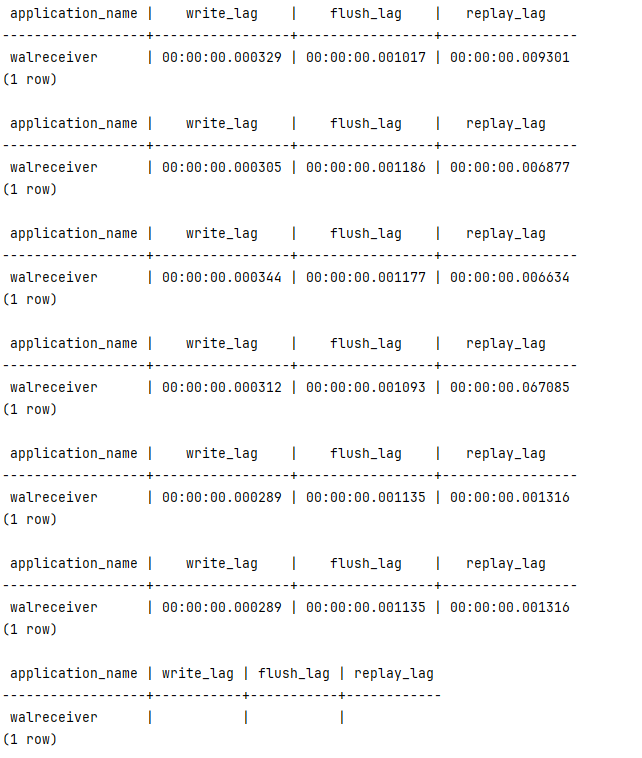

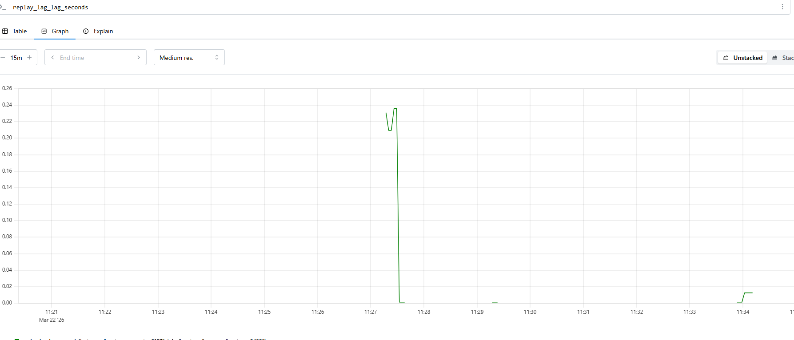

Логически репликации

```sql
CREATE PUBLICATION alltables FOR ALL TABLES;
```
```sql
CREATE SUBSCRIPTION subs
CONNECTION 'host=logical1 port=5432 dbname=steamDB user=postgres password=teamwork.tf application_name=sub1'
PUBLICATION alltables;
```

```sql
INSERT INTO steam.genres(name) VALUES ('LOGICAL')
```

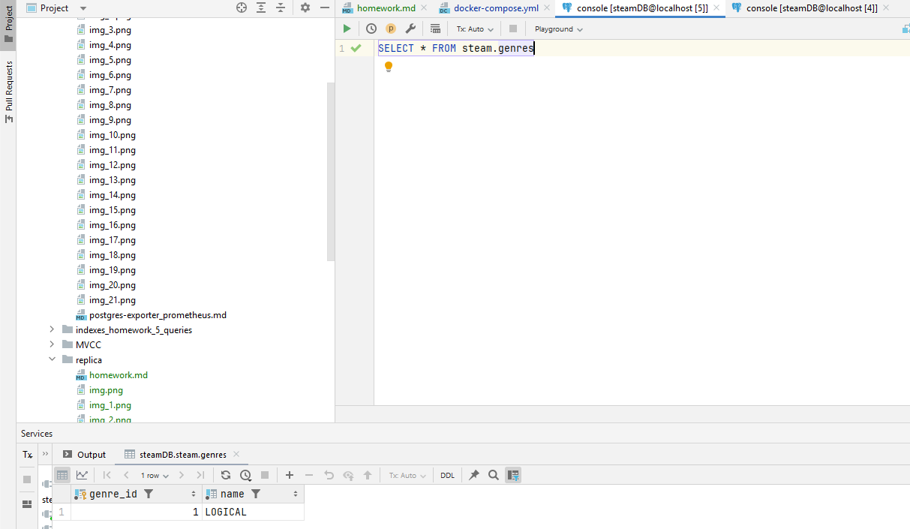

```sql
ALTER TABLE steam.developers ADD COLUMN subs integer;
INSERT INTO steam.developers(name, subs) VALUES ('DEV_LOG', 100)
```

```sql
SELECT * FROM steam.developers
```

реплика
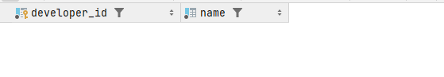

мастер
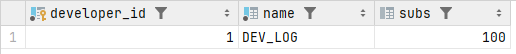

```sql
CREATE TABLE steam.logical_rep (
    id int
);

INSERT INTO steam.logical_rep(id) VALUES (1),(5);
```

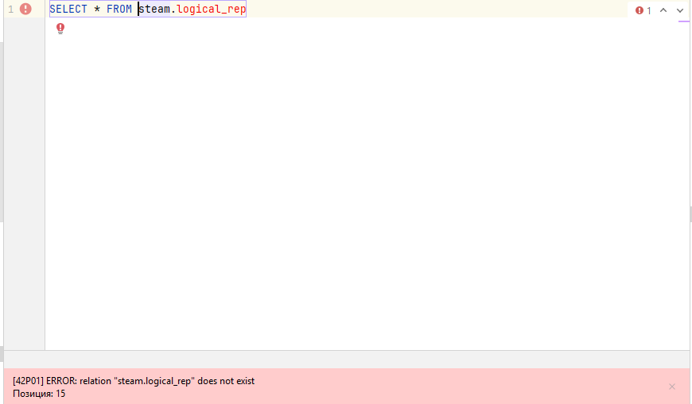

```sql
SELECT * FROM pg_stat_replication;
```

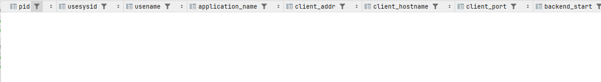

После того как синхронизовал все таблицы вручную
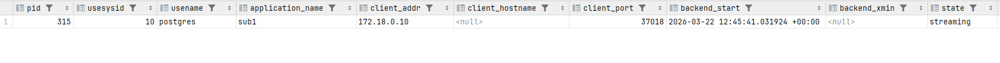