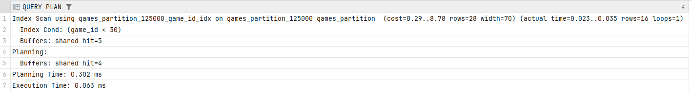
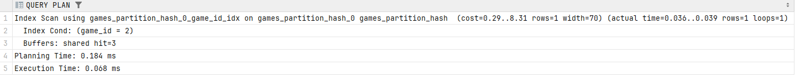
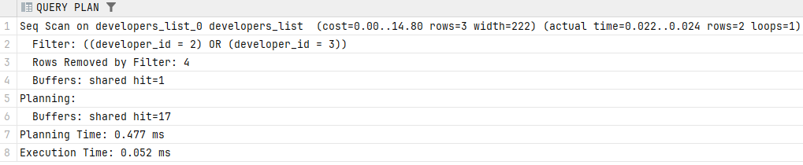
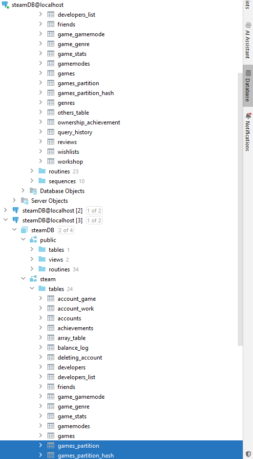
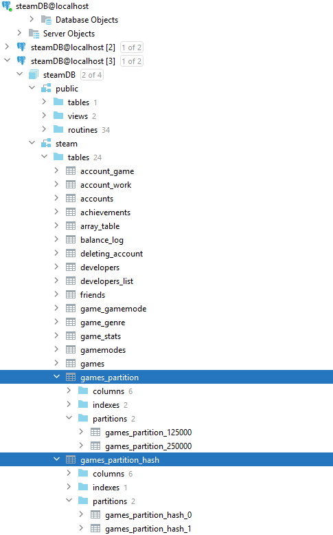
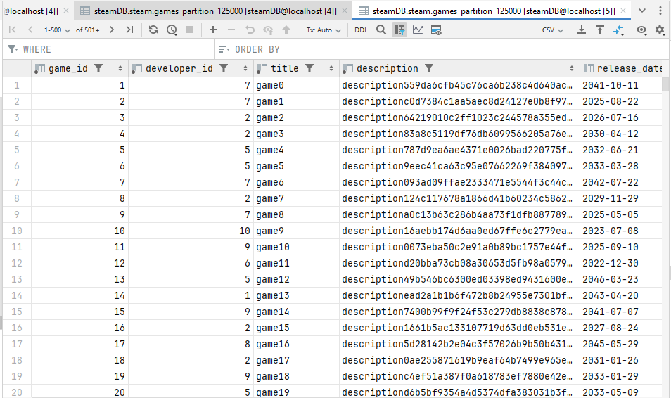
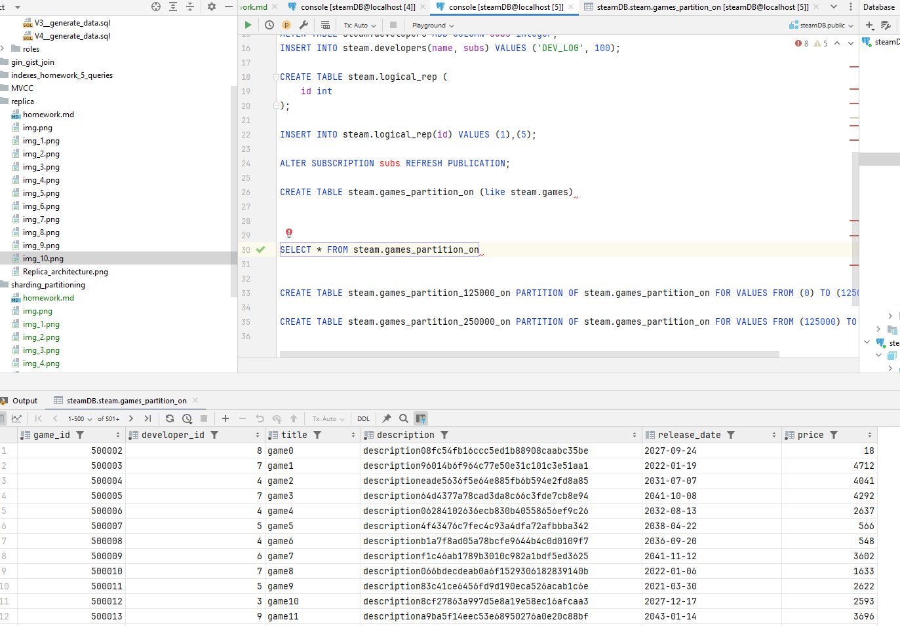
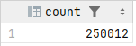
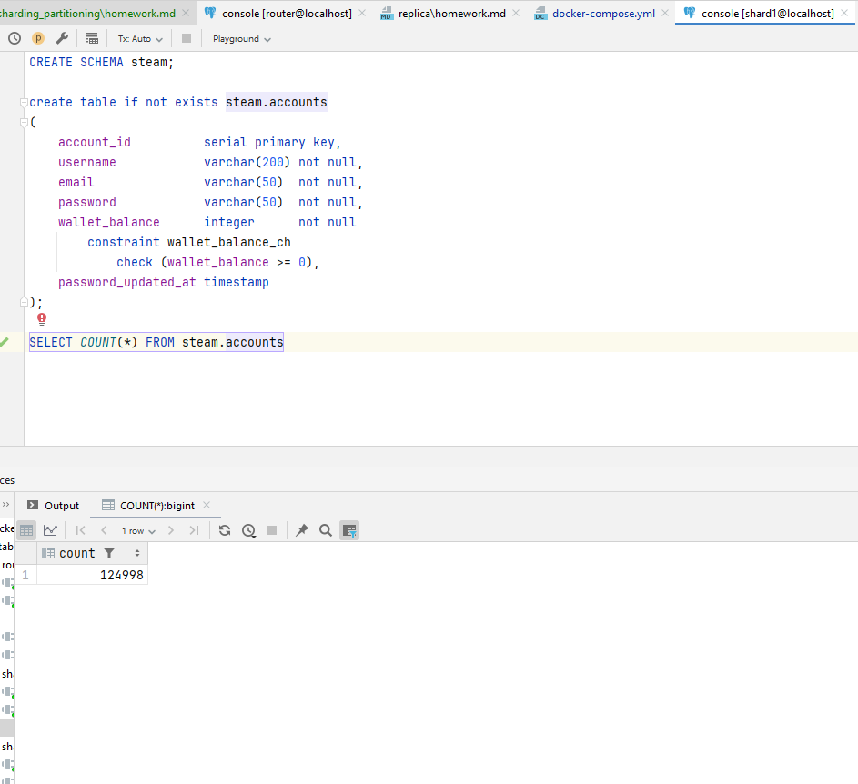

1
```sql

CREATE TABLE steam.games_partition (LIKE steam.games INCLUDING DEFAULTS) PARTITION BY RANGE (game_id);

CREATE TABLE steam.games_partition_125000 PARTITION OF steam.games_partition FOR VALUES FROM (0) TO (125000);

CREATE TABLE steam.games_partition_250000 PARTITION OF steam.games_partition FOR VALUES FROM (125000) TO (300000);

CREATE INDEX ON steam.games_partition (game_id);

INSERT INTO steam.games_partition SELECT * FROM steam.games;

EXPLAIN(ANALYSE, BUFFERS) SELECT * FROM steam.games_partition WHERE game_id < 30
```



```sql
CREATE TABLE steam.games_partition_hash (LIKE steam.games INCLUDING DEFAULTS) PARTITION BY HASH (game_id);

CREATE TABLE steam.games_partition_hash_0 PARTITION OF steam.games_partition_hash FOR VALUES WITH (MODULUS 2, REMAINDER 0);

CREATE TABLE steam.games_partition_hash_1 PARTITION OF steam.games_partition_hash FOR VALUES WITH (MODULUS 2, REMAINDER 1);

CREATE INDEX ON steam.games_partition_hash (game_id);

INSERT INTO steam.games_partition_hash SELECT * FROM steam.games;

EXPLAIN(ANALYSE, BUFFERS) SELECT * FROM steam.games_partition_hash WHERE game_id = 2;
```




```sql
CREATE TABLE steam.developers_list(LIKE steam.developers INCLUDING DEFAULTS) PARTITION BY LIST (developer_id);

CREATE TABLE steam.developers_list_0 PARTITION OF steam.developers_list FOR VALUES IN (1, 2, 3, 4, 5, 6);

CREATE TABLE steam.developers_list_1 PARTITION OF steam.developers_list FOR VALUES IN (7, 8, 9, 10, 11, 12);

CREATE INDEX ON steam.developers_list (developer_id);

INSERT INTO steam.developers_list SELECT * FROM steam.developers;

EXPLAIN(ANALYSE, BUFFERS) SELECT * FROM steam.developers_list WHERE developer_id = 2 or developer_id = 3;
```



2




3

```sql
CREATE TABLE steam.games_partition (LIKE steam.games INCLUDING DEFAULTS) PARTITION BY RANGE (game_id);

CREATE TABLE steam.games_partition_125000 PARTITION OF steam.games_partition FOR VALUES FROM (0) TO (125000);

CREATE TABLE steam.games_partition_250000 PARTITION OF steam.games_partition FOR VALUES FROM (125000) TO (300000);

CREATE PUBLICATION part FOR TABLE steam.games_partition
WITH (publish_via_partition_root = off) ;

INSERT INTO steam.games_partition(developer_id, title, description, release_date, price) SELECT
(random()*9 + 1)::int,
'game' || gs,
'description' || LEFT(md5(random()::varchar), 100),
'2021-01-01'::date + (random() * ('2025-12-31'::date - '2000-01-01'::date)) :: int,
random()*5000
FROM generate_series(0, 250000) as gs;
```



```sql
CREATE TABLE steam.games_partition_on (LIKE steam.games INCLUDING DEFAULTS) PARTITION BY RANGE (game_id);

CREATE TABLE steam.games_partition_50000 PARTITION OF steam.games_partition_on FOR VALUES FROM (0) TO (50000);

CREATE TABLE steam.games_partition_150000 PARTITION OF steam.games_partition_on FOR VALUES FROM (50000) TO (150000);

CREATE TABLE steam.games_partition_300000 PARTITION OF steam.games_partition_on FOR VALUES FROM (150000) TO (300000);

CREATE TABLE steam.games_partition_500000 PARTITION OF steam.games_partition_on FOR VALUES FROM (300000) TO (500000);

CREATE TABLE steam.games_partition_default PARTITION OF steam.games_partition_on DEFAULT;

CREATE PUBLICATION part_on FOR TABLE steam.games_partition_on
WITH (publish_via_partition_root = on) ;

INSERT INTO steam.games_partition_on(game_id, developer_id, title, description, release_date, price) SELECT
gs,
(random()*9 + 1)::int,
'game' || gs,
'description' || LEFT(md5(random()::varchar), 100),
'2021-01-01'::date + (random() * ('2025-12-31'::date - '2000-01-01'::date)) :: int,
random()*5000
FROM generate_series(0, 250000) as gs;

```



```sql
CREATE EXTENSION postgres_fdw;

CREATE SERVER shard1_server
    FOREIGN DATA WRAPPER postgres_fdw
    OPTIONS (host 'shard-1', port '5432', dbname 'shard1');

CREATE SERVER shard2_server
    FOREIGN DATA WRAPPER postgres_fdw
    OPTIONS (host 'shard-2', port '5432', dbname 'shard2');

create table steam.accounts_partition
(
    account_id          serial,
    username            varchar(200) not null,
    email               varchar(50)  not null,
    password            varchar(50)  not null,
    wallet_balance      integer      not null
        constraint wallet_balance_ch
            check (wallet_balance >= 0),
    password_updated_at timestamp
) PARTITION BY RANGE (account_id);

CREATE FOREIGN TABLE steam.accounts_partition_125000 PARTITION OF steam.accounts_partition FOR VALUES FROM (0) TO (125000)
SERVER shard1_server
    OPTIONS (schema_name 'steam', table_name 'accounts');

CREATE FOREIGN TABLE steam.accounts_partition_250000 PARTITION OF steam.accounts_partition FOR VALUES FROM (125000) TO (550000)
SERVER shard2_server
    OPTIONS (schema_name 'steam', table_name 'accounts');

CREATE USER MAPPING FOR current_user SERVER shard1_server OPTIONS (user 'postgres', password 'teamwork.tf');

CREATE USER MAPPING FOR current_user SERVER shard2_server OPTIONS (user 'postgres', password 'teamwork.tf');


INSERT INTO steam.accounts_partition SELECT * FROM steam.accounts;

SELECT COUNT(*) FROM steam.accounts_partition
```



